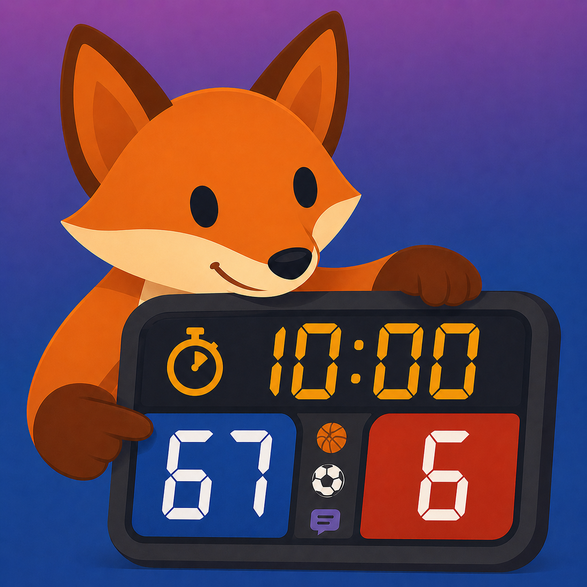

# Scoreboard

  

Scoreboard 是一款适用于 iPhone、iPad、Mac 和 Apple TV 的 SwiftUI 记分牌应用。iPhone、iPad 和 Mac 提供完整的比赛操作界面；Apple TV 则作为只读的远程显示，用来展示已配对 Scoreboard 设备发送的实时记分牌。

本项目使用 AI 生成内容。

> App Store：[链接](https://apps.apple.com/us/app/smart-scoreboard/id6776096875)

## 应用描述

Scoreboard 可以把你的 iPhone、iPad 或 Mac 变成灵活、易操作的记分牌，适合比赛、训练、锦标赛和辩论轮次使用。

你可以在一个清晰的控制面板中管理比分、计时、节次、进攻时间、球权、犯规、牌、换人、球员名单、棋钟、冰球罚时计时器和辩论准备时间。应用也可以通过外接显示器、AirPlay 或一个或多个已配对的远程显示设备展示全屏公共记分牌，同时把操作控制保留在操作员设备上。

内置模式包括简单、篮球、排球、足球、冰球、国际象棋、辩论和自定义运动。辩论模式支持 Public Forum、Lincoln-Douglas、Policy 以及自定义赛制。

Apple TV 有两种使用方式。你可以从操作设备通过 AirPlay 投放到 Apple TV，此时不需要安装 Apple TV 版应用，因为 AirPlay 会被当作外接显示器使用。你也可以在 Apple TV 上安装 Scoreboard，并将它作为远程显示使用。Apple TV 远程显示只负责显示：它不运行操作面板、不编辑比赛设置、不管理文件，也不控制比分。请使用 iPhone、iPad 或 Mac 运行比赛，然后配对 Apple TV 来显示实时公共记分牌。

无论你是在体育馆运行记分牌、为辩论计时、管理训练赛，还是为观众提供整洁的公共显示，Scoreboard 都能让比赛流程保持清晰、有序、可见。

## 完整体验

为了获得完整的 Scoreboard 体验，请连接外接显示器、使用 AirPlay，或配对远程显示设备。AirPlay 可直接配合 Apple TV 使用，不需要在 Apple TV 上安装应用。远程显示适合让附近的 Apple 设备，包括多台显示设备，从同一台操作设备接收同步的记分牌更新。

## 功能

- 实时比分、节次和比赛计时控制
- 支持外接显示器和 AirPlay 公共记分牌，包括无需安装 tvOS 应用的 Apple TV AirPlay
- Apple TV、iPhone、iPad 和 Mac 远程显示配对，并在多台显示设备之间同步实时记分牌
- 内置简单、篮球、排球、足球、冰球、国际象棋和辩论模式
- 自定义运动模式，支持配置节次、计时、加分步进、球权、球员、犯规、牌和换人
- 支持相关运动的进攻时间控制
- 棋钟预设支持子弹棋、超快棋、快棋和经典时限
- 辩论计时支持 Public Forum、Lincoln-Douglas、Policy 和自定义格式
- 冰球罚时计时器
- 球员名单和上场阵容跟踪
- 在支持的运动中跟踪团队犯规、球员犯规、牌、换人和球权
- 多种主题选项，适配不同光线和展示场景
- 可配置比分、计时、提醒、犯规、牌、换人和分数变化等事件声音
- 保存、导入、导出和自动保存比赛文件
- 支持导出的事件日志

## 支持的平台

- iPhone
- iPad
- Mac
- Apple TV（仅远程显示）

iPhone、iPad 和 Mac 应用包含操作界面，也可以在设置中切换为远程显示模式。Apple TV AirPlay 不需要安装 Scoreboard Apple TV 应用。如果安装了 Apple TV 应用，它始终只作为远程显示运行；它用于显示记分牌，而不是控制比赛。远程显示使用 Network Framework Bonjour 配对，不依赖 Web API，并且可以从同一台操作设备同步多台显示设备。操作员可以选择仅同一 Wi-Fi/LAN，或允许附近设备使用 Apple 点对点 Wi-Fi。

## 从源码构建

1. 克隆仓库。
2. 在 Xcode 中打开 `smartScoreboard/smartScoreboard.xcodeproj`。
3. 选择 `smartScoreboard` scheme。
4. 选择 iPhone 模拟器、iPad 模拟器、已连接的 iPhone 或 iPad、Mac，或 Apple TV 模拟器作为运行目标。
5. 构建并运行。

## 项目结构

- `smartScoreboard/smartScoreboard/ContentView.swift` - 主操作界面和设置流程
- `smartScoreboard/smartScoreboard/ExternalScoreboardView.swift` - 公共记分牌显示
- `smartScoreboard/smartScoreboard/ScoreboardStore.swift` - 应用状态和计分逻辑
- `smartScoreboard/smartScoreboard/SportType.swift` - 运动预设和规则能力
- `smartScoreboard/smartScoreboard/DebateModels.swift` - 辩论格式和计时片段
- `smartScoreboard/smartScoreboard/ScoreboardGameDocument.swift` - 已保存比赛文件格式
- `smartScoreboard/smartScoreboard/ScoreboardLogging.swift` - 事件日志存储和导出
- `smartScoreboard/smartScoreboard/BuzzerPlayer.swift` - 生成的事件声音
- `smartScoreboard/smartScoreboard/ScoreboardTheme.swift` - 应用和记分牌主题

## 文件类型

Scoreboard 使用基于 JSON 的自定义文档类型：

- `.scoreboardgame` 用于保存比赛状态
- `.scoreboardlog` 用于导出日志会话

## 许可证

本项目基于 GNU General Public License v3.0 授权。详情请参阅 [LICENSE.md](LICENSE.md)。
